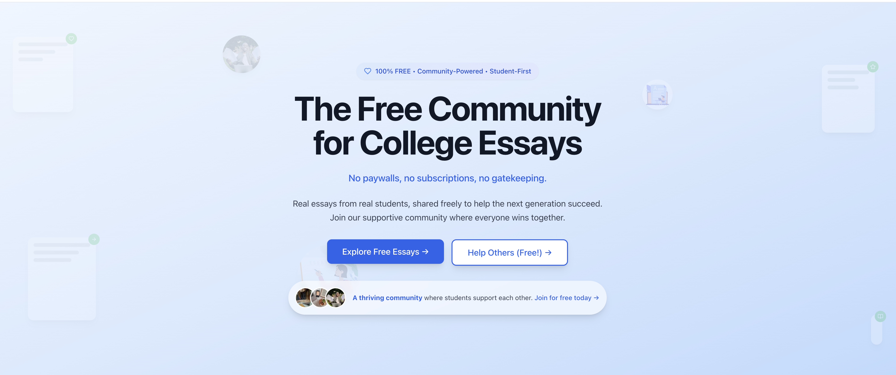

# PromptBase - College Essay Repository

A modern, database-backed college essay repository built with Next.js and Supabase. Browse real college essays from admitted students, filter by school, major, and prompt type, and contribute your own successful essays.

## Screenshot

## Features

-  **Browse Essays**: Read through successful college essays from top universities
-  **Advanced Filtering**: Filter by college, major, prompt type, and search by keywords
-  **Submit Essays**: Contribute your own successful essays to help others
-  **Fast & Modern**: Built with Next.js 15, TypeScript, and Tailwind CSS
-  **Database-Backed**: Powered by Supabase for real-time data management

## Tech Stack

- **Frontend**: Next.js 15, TypeScript, Tailwind CSS
- **Database**: Supabase (PostgreSQL)
- **UI Components**: shadcn/ui
- **Form Handling**: React Hook Form with Zod validation
- **Deployment**: Vercel (or any Node.js hosting)
